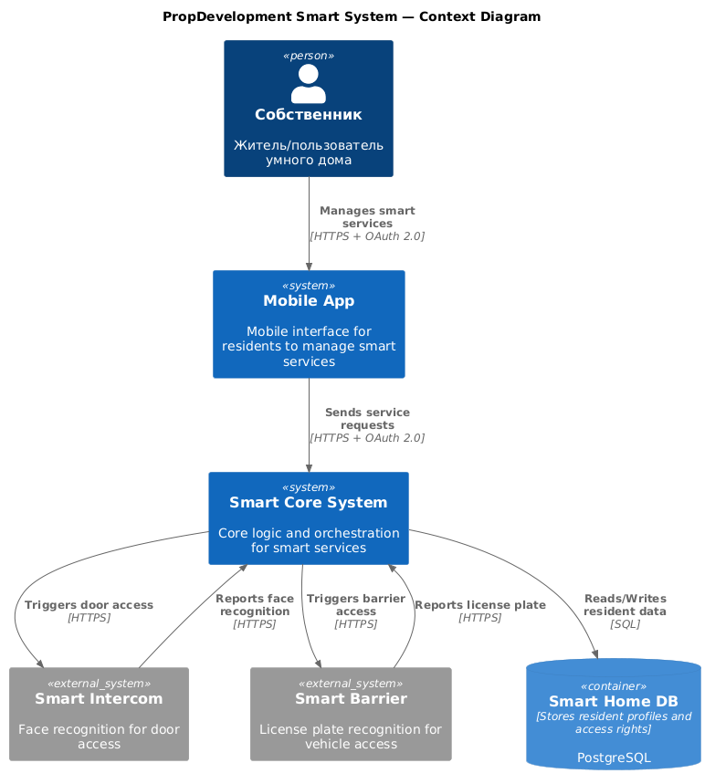
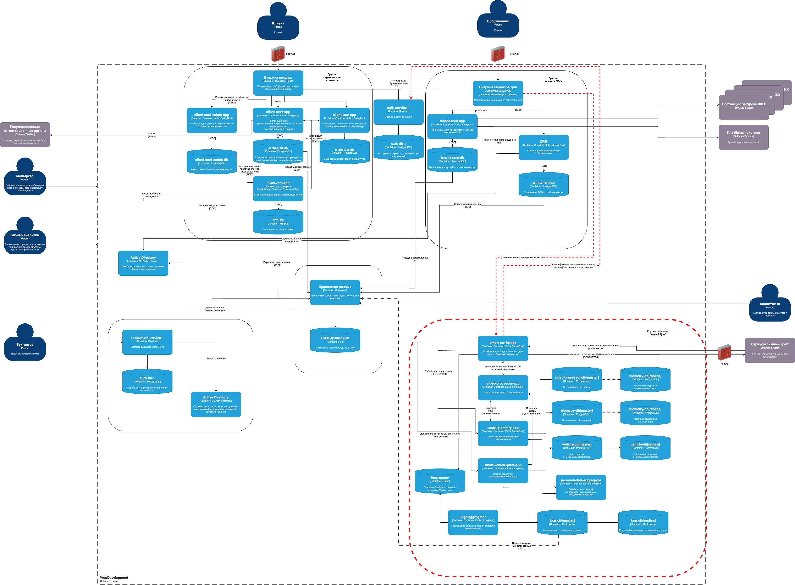

# Задание 3. Внешние интеграции
# Требования к безопасности и взаимодействию с внешней платформой

## 1. Информационная безопасность

### 1.1 Обработка персональных данных

* Необходимо обеспечить получение явного согласия пользователя на обработку персональных данных, в соответствии с требованиями законодательства (например, GDPR, Закон "О персональных данных").
* Все передаваемые данные должны быть зашифрованы с использованием протокола TLS версии 1.3.
* Шифровальные ключи должны храниться в сертифицированных аппаратных модулях безопасности (HSM). Доступ к ключам предоставляется исключительно через защищённый API, с обязательной двухфакторной аутентификацией.
* Требуется регулярная ротация ключей шифрования не реже одного раза в 3–6 месяцев.

### 1.2 Логирование и аудит

* Все действия пользователя (добавление лица, регистрация номера, отправка команд и др.) должны логироваться.
* Логи должны обеспечивать аудит действий в полном объеме, при этом персональные данные в логах должны быть маскированы или токенизированы.
* Логирование должно быть защищено от несанкционированного доступа и модификации.

### 1.3 Мониторинг и реагирование на инциденты

* Необходимо внедрить SIEM-систему для централизованного мониторинга событий информационной безопасности, анализа поведения пользователей и выявления потенциальных угроз в реальном времени.
* Настраиваются автоматические оповещения об аномальной активности и попытках несанкционированного доступа.

### 1.4 Управление доступом

* Пользователю (собственнику) необходимо предоставить доступ только к разрешённым объектам управления (например, домофон, шлагбаум) в рамках модели наименьших привилегий.
* Все запросы к критическим компонентам системы должны проходить авторизацию и журналироваться.

### 1.5 Хранение и защита данных

* Все персональные данные в базе данных должны храниться в зашифрованном виде с использованием хэширования и токенизации.
* Хранение биометрических данных в открытом виде недопустимо.
* Используется DLP-система (Data Loss Prevention) для предотвращения утечек данных через внешние интерфейсы.

### 1.6 Безопасность облачной инфраструктуры

* В Kubernetes-кластере должна быть реализована модель RBAC (Role-Based Access Control), ограничивающая права пользователей до минимально необходимых.
* Настроены сетевые политики для ограничения межсервисного взаимодействия и контроля сетевого трафика.

## 2. Аутентификация и авторизация

* Во взаимодействии с внешним партнером используется протокол авторизации OAuth 2.0.
* Аутентификация пользователей осуществляется через корпоративную систему управления доступом (например, Keycloak с поддержкой многофакторной аутентификации и/или Active Directory).
* Собственник имеет доступ только к определённым точкам входа, к которым он уполномочен.

## 3. Сценарий взаимодействия при открытии домофона

### 3.1 Этапы

1. Пользователь (собственник) инициирует процесс через мобильное приложение, загружая фотографию своего лица.
2. Приложение передаёт изображение на сервер PropDevelopment по защищённому каналу (HTTPS с TLS 1.3).
3. Сервер преобразует изображение в биометрический шаблон.
4. Биометрический шаблон шифруется и сохраняется в зашифрованной базе данных.
5. Камера домофона фиксирует лицо посетителя.
6. Сформированное изображение отправляется в систему внешнего партнёра ("Умный дом").
7. Система "Умного дома" создаёт биометрический шаблон на основе полученного изображения.
8. Шаблон направляется в PropDevelopment для верификации через API с использованием TLS.
9. PropDevelopment сравнивает полученный шаблон с шаблонами, хранящимися в своей базе:

   * При совпадении отправляется подтверждение доступа.
   * При отсутствии совпадения отправляется отказ в доступе.
10. В случае положительного ответа система "Умного дома" инициирует открытие двери.
11. Все этапы взаимодействия логируются на стороне PropDevelopment с применением защиты логов.

## Context Diagram

## Container Diagram
